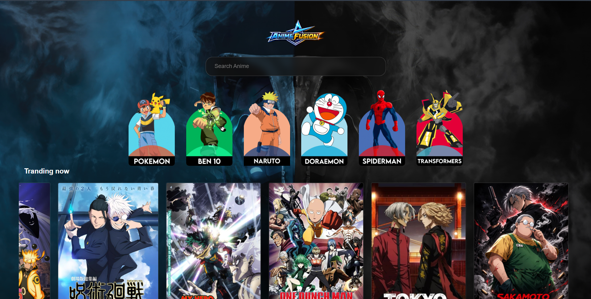

# 🎌 Anime-fusion-Website

A responsive Anime Website built using **HTML** and **CSS**. This project showcases a modern anime-themed user interface with a clean layout and responsive design.

---

## 🚀 Features

- Responsive Design
- Modern UI
- Hero Banner
- Anime Cards
- Navigation Bar
- Footer
- Clean Layout

---

## 🛠 Technologies Used

- HTML5
- CSS3

---

## 📷 Preview



---

## 📂 Project Structure

```
anime-website/
│
├── assets/
├── homepage.png
├── index.html
├── style.css
└── README.md
```

---

## ▶️ How to Run

1. Download or clone this repository.
2. Open the project folder.
3. Open `index.html` in your browser.

---

## 📚 Learning Outcomes

- HTML Structure
- CSS Styling
- Responsive Design
- Layout Design
- UI Development

---

## 👨‍💻 Author

**Kartik Yadav**

GitHub: https://github.com/Kartiky003

---

⭐ If you found this project useful, consider giving it a star.
